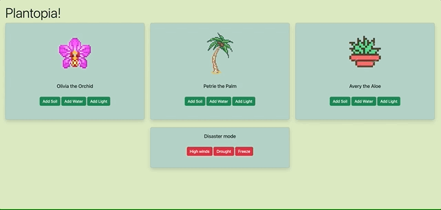

# 🪷 Plantopia 🪷

#### By _Molly Donegan & Asia Kaplanyan_

#### _A functional JavaScript web application where users become virtual gardener and take care of their own plants. Players are able to water, feed, and give their plants the right amount of sunlight to help them grow and thrive._

## 🌱 Technologies Used 🌱

- _JavaScript_
- _Webpack_
- _ESLint_
- _Babel_
- _JEST_

## 🌱 Setup/Installation Requirements 🌱

* _Clone this repository to your desktop_
* _Navigate to the top level of the directory_
* _Install all Node packages and dependencies with the command ``npm install``_
* _Build the project using webpack with ``npm run build``_
* _Package and open the project in your browser using ``npm run start``_
* _Lint JS files in the ``src`` folder with ``npm run lint``_
* _Run tests with Jest using ``npm run test``_

## 🌱 Known Bugs 🌱

* NA

## 🌱 License 🌱

* [MIT](https://github.com/mdonegan91/Plantopia/blob/main/LICENSE)

Copyright (c) _2023_ _Molly Donegan & Asia Kaplanyan_